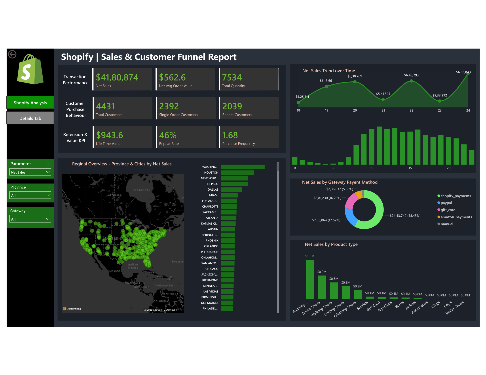

# 🛍️ Shopify Sales & Customer Funnel Dashboard — Power BI

> An end-to-end business intelligence project analyzing Shopify store performance across sales, customer behavior, geography, and product categories — built to support data-driven decisions.

---

## 📊 Dashboard Preview



---

## 🧠 Project Overview

This project transforms raw Shopify transaction-level data into an interactive Power BI dashboard that gives business stakeholders a 360° view of store performance. The dashboard is structured around three core analytical dimensions:

| Dimension | Focus |
|---|---|
| **Transaction Performance** | Revenue, order value, and volume |
| **Customer Behavior** | Retention, repeat purchases, and lifetime value |
| **Regional & Product Intelligence** | Where sales happen and what drives them |

---

## ❓ Business Questions Answered

### 💰 Revenue & Sales Performance
- **What is the total revenue generated by the store?**
  → Net Sales: **$41,80,874** across **7,534 total quantities**
- **What is the average order value?**
  → Net Average Order Value: **$562.6**
- **How has revenue trended over time?**
  → The line chart reveals seasonal peaks and dips — highest recorded at **$6,83,843** — enabling demand forecasting

### 👥 Customer Behavior & Retention
- **How many unique customers does the store have?**
  → **4,431 total customers**
- **What proportion of customers are repeat buyers vs. one-time buyers?**
  → **2,039 repeat customers (46% repeat rate)** vs. **2,392 single-order customers**
- **How loyal is the customer base?**
  → **Lifetime Value: $943.6** | **Purchase Frequency: 1.68** — indicating moderate loyalty with room to grow

### 🌍 Regional Performance
- **Which cities and provinces drive the most revenue?**
  → Washington, Houston, and New York lead city-level net sales
- **Where are we underperforming geographically?**
  → The interactive map and bar chart expose untapped or low-performing markets for targeted campaigns
- **Should we prioritize regional marketing spend differently?**
  → Regional data supports budget allocation decisions by geography

### 💳 Payment Gateway Analysis
- **Which payment method do customers prefer?**
  → **Shopify Payments dominates at 58.45% ($24.4M)**, followed by Amazon Payments (17.62%) and PayPal (16.29%)
- **Are there gateway-related drop-off risks?**
  → Gift card and manual payment methods represent a small but notable share — worth monitoring for checkout friction

### 👟 Product Intelligence
- **Which product categories generate the most revenue?**
  → **Running Shoes lead at ~$1.5M**, followed by Tennis Shoes (~$0.9M) and Walking Shoes (~$0.6M)
- **Which categories are underperforming?**
  → Clogs, Boy's, and Water Shoes show near-zero sales — candidates for discontinuation or repositioning
- **Where should inventory investment be focused?**
  → Top 5 categories account for the majority of revenue — concentrate stock and marketing here

---

## 🛠️ Tools & Technologies

| Tool | Purpose |
|---|---|
| **Microsoft Excel** | Data extraction and initial cleanup |
| **Power BI Desktop** | Data modeling, DAX measures, and dashboard design |
| **Power Query** | Data transformation and shaping |
| **DAX** | Calculated measures (LTV, repeat rate, avg order value, etc.) |

---

## 🔍 How to Use This Dashboard

1. **Clone or download** this repository
2. Open `dashboard/Shopify_Dashboard.pbix` in **Power BI Desktop**
3. If prompted, update the data source path to point to `data/shopify_sales_data.xlsx`
4. Use the **Province**, **Gateway**, and **Parameter** slicers on the left panel to filter views
5. Hover over any chart element for detailed tooltips
6. Use the **Details Tab** for transaction-level drill-through

---


## 🚀 Getting Started

### Prerequisites
- [Power BI Desktop](https://powerbi.microsoft.com/desktop/) (free)
- Microsoft Excel (for viewing raw data)

### Steps
```bash
# 1. Clone the repository
git clone https://github.com/YOUR_USERNAME/shopify-powerbi-dashboard.git

# 2. Navigate to the project directory
cd shopify-powerbi-dashboard

# 3. Open the dashboard
# Launch Power BI Desktop and open: dashboard/Shopify_Dashboard.pbix
```

---

## 📄 License

This project is licensed under the MIT License — see the [LICENSE](LICENSE) file for details.

---

## 👤 Author

**ARSHAD K I SHAIKH**
- GitHub: (https://github.com/Arshadkishaikh)
- LinkedIn: (https://linkedin.com/in/arshadkishaikh/)

---

> ⭐ If you found this project useful, please consider giving it a star!
